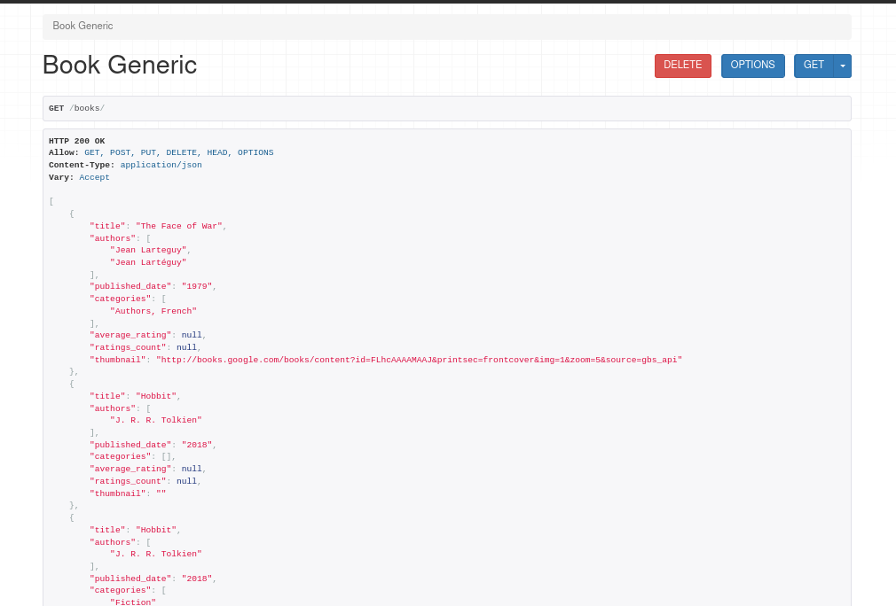
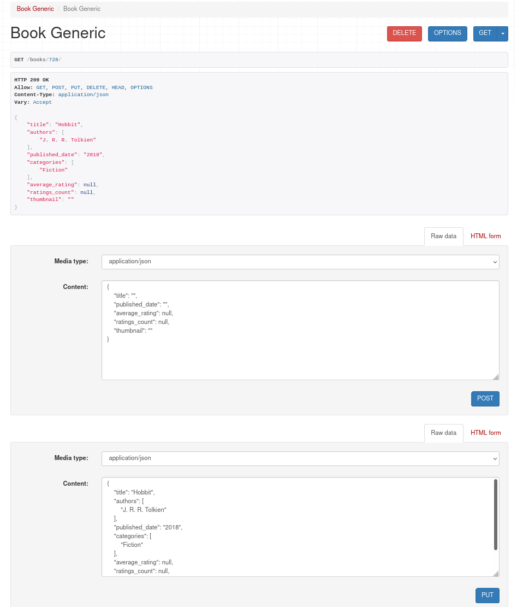

# Books REST API

## Table of Contents
* [General info](#general-info)
* [Technologies](#technologies)
* [Scope of functionalities](#scope-of-functionalities)
* [Illustrations](#illustrations)
* [Project status](#project-status)

### General info
REST API able to upload JSON book data from url and upload it to the DataBase. Data can be updated, deleted and changed,
user can sort and filter data from url.

### Technologies
Project is created with:
* Python (Django REST framework)
* HTML
* Java Script
* DataBase: PostgreSQL

### Scope of functionalities
* Upload data from url (JSON format)
* Update data from url (JSON format)
* Get list of books in JSON formt
* Get one specific book details
* Sort books by publishing date
* Filter books by publishing date

### Illustrations
* Book list:

* Specific book data:

### Project status
In progress